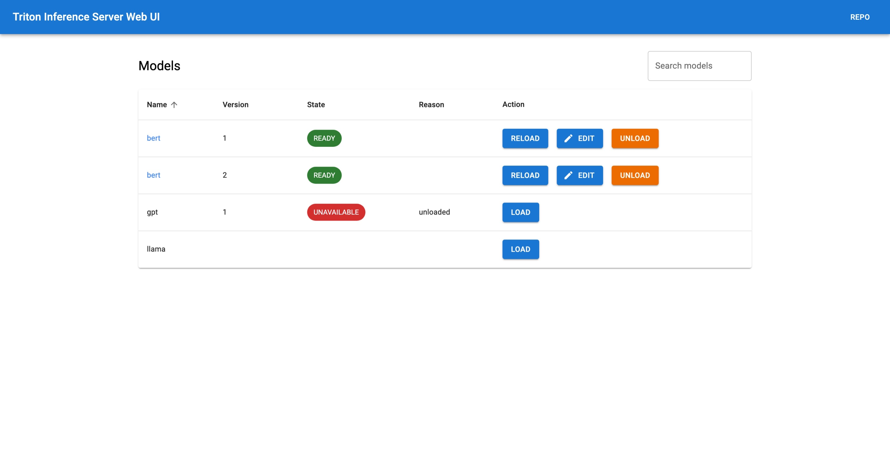

# Triton Inference Server Web UI

Manage and monitor your Triton Inference Server with a web browser. You can use this project to develop and test your models on Triton Inference Server more easily. It is also useful for monitoring your models in production but it is not recommended to edit model configuration in production since it will be lost when the server restarts.

This project is built on top of Triton Inference Server HTTP API. It is not affiliated with NVIDIA.




## Features
- List all models from the model repository.
- Easily load/unload models from the model repository.
- View & edit model configuration on the fly.
- Monitor models metrics.

## Installation

### Docker
Pull the image:
```bash
docker pull duyvd/triton-inference-server-web-ui
```

Run the container:
```bash
docker run -d --name triton-inference-server-web-ui \
    -p 3000:3000 \
    -e API_URL=<api-url> \
    -e API_AUTH_HEADER=<api-auth-header> \
    duyvd/triton-inference-server-web-ui
```

Where:
- `<api-url>` is the URL of the HTTP server, usually on port 8000.
- `<api-auth-header>` is optional, if your Triton Inference Server is protected by an authentication header.

For local Triton Inference Server, you can use the following command:
```bash
docker run -it --name triton-inference-server-web-ui \
    -p 3000:3000 \
    -e API_URL=http://localhost:8000 \
    duyvd/triton-inference-server-web-ui
```

Finally, open your browser and go to http://localhost:3000.

### Build from source

Prerequisites:
- Node.js >= 18

Clone the repository and install dependencies:
```bash
git clone https://github.com/duydvu/triton-inference-server-web-ui
cd triton-inference-server-web-ui
npm install
```

Prepare the `.env` file at the root of the project:
```bash
# The URL of the HTTP server, usually on port 8000
API_URL=<api-url>
# Optional, if your Triton Inference Server is protected by an authentication header
API_AUTH_HEADER=<api-auth-header>
```

For local Triton Inference Server, you can use the following `.env` file:
```bash
API_URL=http://localhost:8000
```

Build:
```bash
npm run build
```

Run the server:
```bash
npm start
```
